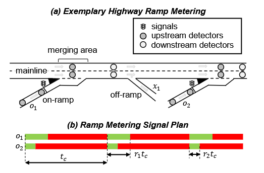
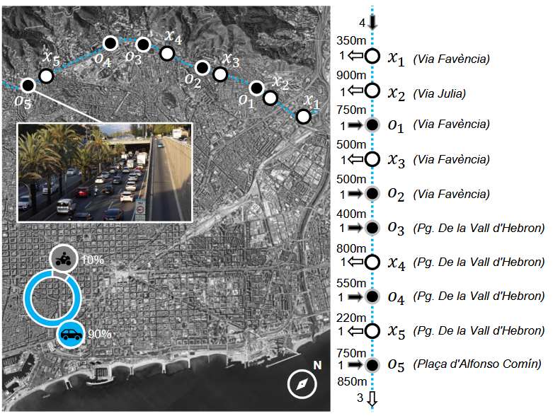
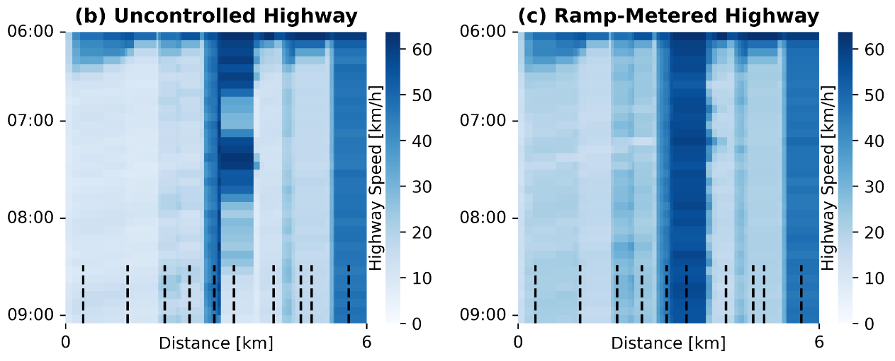

# EQ-ALINEA – Equitable Ramp Metering For Sustainable Metropolitan Highways

## Introduction

This is the online repository of *"EQ-ALINEA – Equitable Ramp Metering
For Sustainable Metropolitan Highways"*. This repository contains a Python-implementation of a traffic microsimulation to demonstrate the potential of **EQ-ALINEA** controller. The repository is based on [SUMO (provided by DLR)](https://eclipse.dev/sumo/).

<table>
    <tr>
        <td></td>
        <td></td>
        <td></td>
    </tr>
    <tr>
        <td><center>No Control</center></td>
        <td><center>Downstream ALINEA</center></td>
        <td><center>Downstream EQ-ALINEA</center></td>
    </tr>
</table>

## Abstract
Highway congestion leads to urban traffic diversion, increased emissions, and extended travel times.
Even though ramp metering systems effectively reduce congestion, they often do face public opposition and lack acceptance due to inequitable delay distribution and ramp access among users.

*EQ-ALINEA*, an extension to the *ALINEA* algorithm, balances both the fairness and efficiency aspects of ramp metering.
*EQ-ALINEA* implements Utilitarian (total travel time), Rawlsian (maximum waiting times at on-ramps), and Egalitarian (dispersion of delays) fairness.
Three boundary conditions prevent queue spill-backs, unacceptably long maximum waiting times, and ensure sufficient time for ramp dequeueing.


<table>
    <tr>
        <td></td>
        <td></td>
    </tr>
</table>

A microsimulation-based case study on Barcelona's metropolitan highway ring-road *Ronda de Dalt* showcases how *EQ-ALINEA* can effectively improve efficiency and fairness of highway traffic.
The results show that more equitable transportation does not have to come at the cost of losses in efficiency or environmental impact.
Besides democratizing the delay distribution over the user population (50% smaller Gini-coefficient) and significantly reducing maximum waiting times (by 40%), *EQ-ALINEA* redistributes highway accessibility to create more equal opportunities for all ramp users.


<table>
    <tr>
        <td></td>
    </tr>
</table>

Ultimately, the contribution of this work is to gain public acceptance for ramp metering by integrating fairness into the traffic control strategy. 


## What you will find in this repository

This repository contains the simulation model and source code to reproduce the findings of our study.
The folder contains following information:

```
./
├── code/
│   └── RunSimulation.py
├── data/
│   └── RoadSequence of Edges.xlsx
├── figures/
│   └── ...
├── logs/
│   ├── logs_DOWN_ALINEA.zip
│   ├── logs_DOWN_EQ_ALINEA.zip
│   ├── logs_UP_ALINEA.zip
│   ├── logs_UP_EQ_ALINEA.zip
│   └── logs_NO_CONTROL.zip
└── model/
    ├── Configuration.sumocfg
    ├── Network.net.xml
    └── ...
```

- The source code for this study can be found in folder *code/*.
- Some of the figures used in the paper can be found in folder *figures/*.
- The log files used for the analysis in this study can be foud in folder *logs/*.
- The SUMO model and all related files can be found in folder folder *model/*.


## Installation & Run Instructions

```
pip install -r requirements.txt
python code/RunSimulation.py --help
# python RunSimulation.py --sumo-path [A] --controller [B]
```

To run the simulation, two to three runarguments are necessary:
- [A] path to SUMO installation directory
- [B] control algorithm, Options: ["NO_CONTROL", "DOWN_ALINEA", "UP_ALINEA", "DOWN_EQ_ALINEA", "UP_EQ_ALINEA"]

### Example Command To Launch Simulation
**with a Downstream ALINEA controller**
```
python RunSimulation.py --sumo-path ./sumo-1.19.0/bin/sumo-gui.exe --controller DOWN_ALINEA
```

**with a Upstream EQ-ALINEA controller**
```
python RunSimulation.py --sumo-path ./sumo-1.19.0/bin/sumo-gui.exe --controller UP_EQ_ALINEA
```

After running, a folder "logs" will appear in "/model/logs" that contains log files created by SUMO, with following contents:

## Log Files
| Log-File    | Description |
| -------- | ------- |
| Emissions.xml  | Log file with information about emissions. |
| Log_summary.xml | Log file with information about the networks traffic state for regular intervals. |
| TripInfos.xml | Log file with information about single vehicle's trips. |
| log_edges.xml | Log file with information about each edge's state over the simulation time. |
| E*X*_UpRamp.xml | Log file with information from the ramps' sensors. |


## Citation
If you found this repository helpful, please cite our work:
```
Kevin Riehl, Yangle Zhan, Anastasios Kouvelas, Michail A. Makridis
"EQ-ALINEA – Equitable Ramp Metering For Sustainable Metropolitan Highways", 2025.
Submitted to CDC2025: 64th IEEE Conference on Decision and Control, Rio de Janeiro, Brazil.
```

